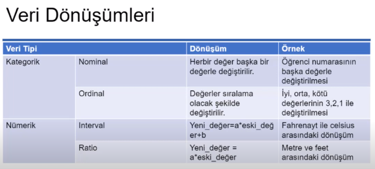
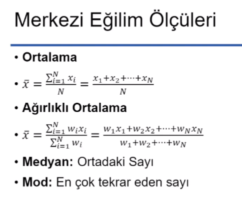
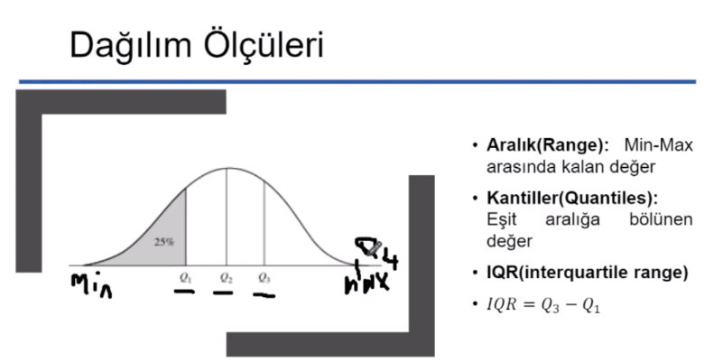
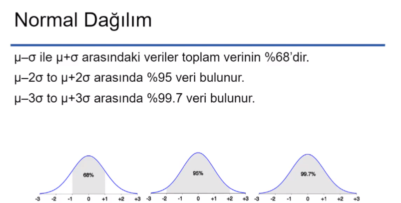
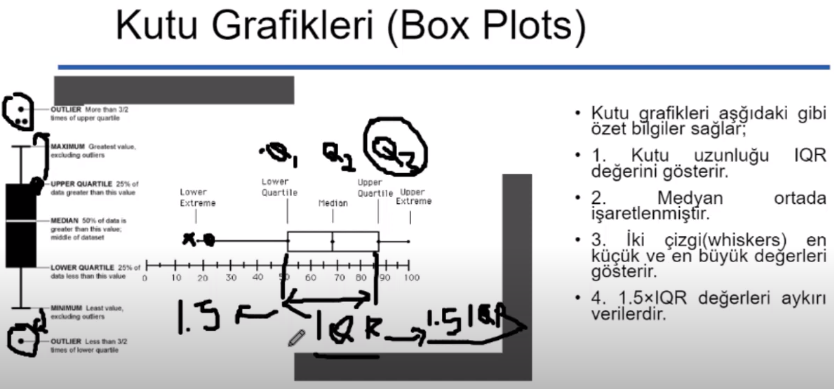
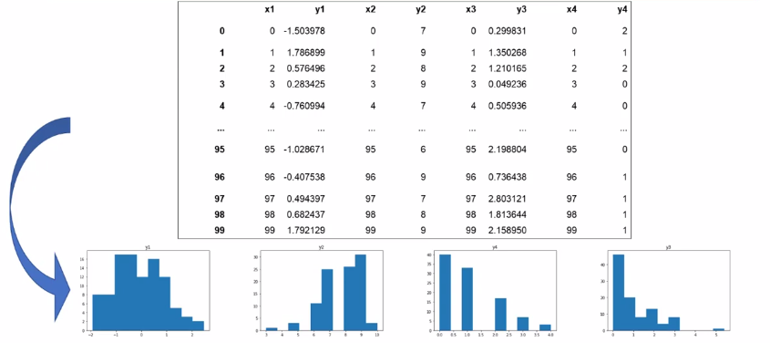

    Numpy (Bilimsel Hesaplama)

    Matplotlib (Veri Görselleştirme)

    Scipy (İstatistik İçin Araç)

    scikit-learn (Makine Öğrenmesi,Sınıflama,Regresyon,Kümeleme,Boyutluk Azaltma Gibib İstatiksel Modelleme İçin Araç)

    Pandas (Veri Toplama ve Hzırlama)

# Veri Hazırlama ve Önişleme

# Data Propercessing

    (Kategorik Veriler)

    Nominal Veriler:

Daha fazla ifadesi ile kullanılmazlar.ID,göz,rengi (Eşitlik var mı yok mu?)

    Sıralama Ölçeği(Ordinal):

Daha fazla ifadesi ile kulanlırlar.Uzunluk(uzun,orta boy,kısa)vb. (Büyüklük küçüklük)

    (Sayısal(Numeric) Veriler)

    Aralıklı(Interval):

Fahrenhait,Celcius vb.

    Oran (Ratio):

Başlangıç noktası 0'dır ve 0 noktası yokluk ifade eder.Kelvin,uzunluk(cm),zaman gibi.

# Sürekli ve Kesikli Değişkenler 

    Sürekli Değişken:

Sınırsız sayıda değere sahiptir.
Genellikle küsuratlı değerler ile ifade edilir.

    Kesikli Değişken:

Belirli sayıda değere sahiptir.
Genellikle tam sayılı değerler ile ifade edilir.
İkili(Binary) gösterim bu göterimin bir çeşididir. (Var yada yok)

## Temel İstatistik Hesaplamaları

Bölümler çeyrekleri temsil eder.

Altta kalan alan olayın olma olasılığını verir.

## Histo-gram(Kutup Grafikleri)

Verinin dağılımı ile ilgili bilgi verir.

## Dağılım(Scatter) Grafiği

Veriler arasında ilşki, trend ya da örüntü olup olmadığını kontrol için çizilir.

Herbir ikili değer x ve y eksenindeki noktada işaretlenir.

Noktalar ve ayrılıklar hakkında hızlı bir görüş açısı sağlar.

Herbir nokta veri ve özellik hakkında bilgi verir.

# Varyans ve Standart Sapma

## Kayıt Veriseti

## Veri Matrisi (Numeric)
Verilerin tamamı sayılardan oluşuyorsa bu veri şekli.

## Belge Veriseti

## İşlemler Veriseti
Özel bir kayıt verisidir.Her kayıt birkaç elemandan oluşan setleri tutar.

## Grafik Veriset
Molekül yapısı ya da internet sayfalarının gösterilmesi.

## Benzerlik Ölçütleri

    Benzerlik Ölçüsü:
İki verinin benzeyip benzemediğinin nümerik ölçüsü.
[0-1] arasında bir değerle ölçülür ve 1'e yakın olması daha fazla benzediği anlamına gelir.

    Uzaklık(Benzemezlik) Ölçüsü:
İki veri birbirinden ne kadar farklı olduğunun ölçülmesi durumu.
Eğere benzemez ise değer 0'a yakın çıkar.

## Kümelemede Benzerlik Ölçütleri

## Veri ve Uzaklık Matrisi

## Nominal Verilerin Uzaklık Hesabı

## Eksik Veriler 

    Tamamen rastgele eksik olan veriler 
Tüm değişkenlere ait verilerden herhangi birisinde eksik veri yer alabilir.
Bu veriler rastgele bir değer ile doldurulabilir.

    Diğer Doldurma Metotları
Ortalama ile doldurma 
Mod,medyan ile doldurma
Akıllı bir algoritma kullanarak doldurma

1. Eksik verileri gözardı et.
2. Elle doldur.
3. lobal bir değişken kullan.
4. Merkezi bir ölçü kullanarak değiştir.
5. Aynı sınıfa ait mrkezi bir ölçü ile değiştir.
6. Olası bir değer ile değiştir.

## Gürültülü Veri 
Uç verilerin veri setine girmesi.Örneğin ses kalitesi düşük olan bi telefondan alınan insan sesi frekansları.

## Aykırı (Uç) Veriler

## Tekrarlı Veriler

## Birleştirme

## Örneklem Alma
Örneklemin evrensel kümeyi temil etmesi gerekir.

1. Herhangi bir elemanın seçilmesinin eşit olasılıklı olması
2. Seçerek Ayırma
2.1. Rastgele seçilen verilerin örneklemden çıkarılması
3. Verileri küçük parçalara bölmek

## Özellik İndirgemesi

Teknikler:

Birincil Etken Analizi(PCA=principle Component Analysis)

## Kesikli Hale Getirme

## İkili Sisteme Çevirme

## Özellik Dönüşümleri 

    Normalizasyon
Özellik verileri arasındaki farklılıkları azaltarak bir aralık içerisine alma işlemi
Sezonal etki gibi istenmeyen özellikler ortadan kalkar.

    Standardizasyon
Verinin ortalamadan çıkarılarak standart sapmasına bölünmesi ile elde edilen sonuçlardır.

## Veri Görselleştirme

