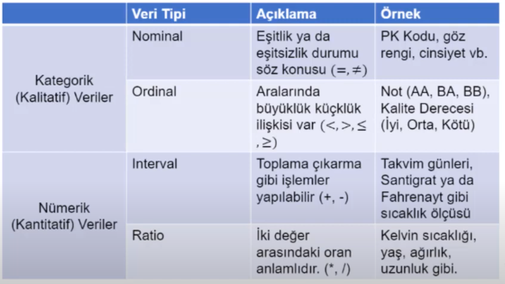

    Numpy (Bilimsel Hesaplama)

    Matplotlib (Veri Görselleştirme)

    Scipy (İstatistik İçin Araç)

    scikit-learn (Makine Öğrenmesi,Sınıflama,Regresyon,Kümeleme,Boyutluk Azaltma Gibib İstatiksel Modelleme İçin Araç)

    Pandas (Veri Toplama ve Hzırlama)

# Veri Hazırlama ve Önişleme

# Data Propercessing

    (Kategorik Veriler)

    Nominal Veriler:

Daha fazla ifadesi ile kullanılmazlar.ID,göz,rengi (Eşitlik var mı yok mu?)

    Sıralama Ölçeği(Ordinal):

Daha fazla ifadesi ile kulanlırlar.Uzunluk(uzun,orta boy,kısa)vb. (Büyüklük küçüklük)

    (Sayısal(Numeric) Veriler)

    Aralıklı(Interval):

Fahrenhait,Celcius vb.

    Oran (Ratio):

Başlangıç noktası 0'dır ve 0 noktası yokluk ifade eder.Kelvin,uzunluk(cm),zaman gibi.

